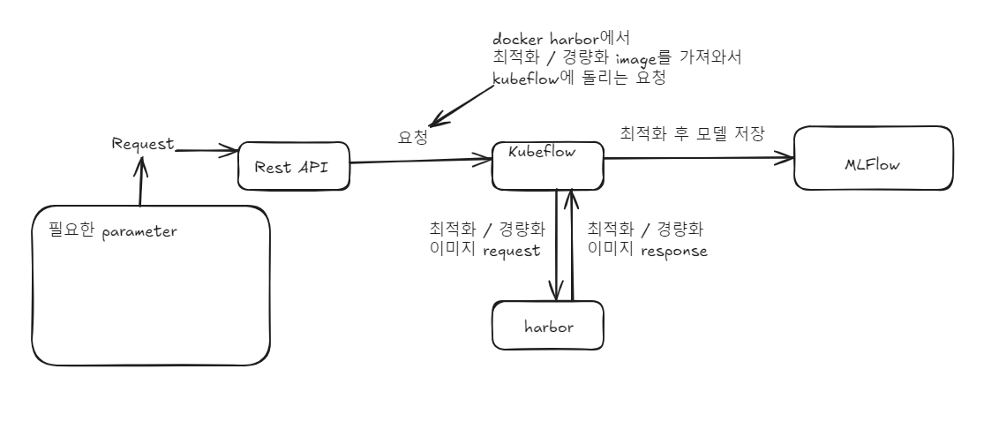

# Lite-Model-Workflow

Lite-Model-Workflow는 모델의 최적화 및 경량화를 쉽게 할 수 있게 도와주는 시스템입니다.
사용자는 이 시스템을 통해서 모델을 입력하고 최적화 및 경량화가 된 모델을 응답받을 수 있습니다.
<br/>

## Tech Stack


<br/>
# Key Features

Lite-Model-Workflow의 주요 기능은 다음과 같습니다.

1. **경량화/최적화**: REST API를 통해 최적화 및 경량화 시킬 모델과 최적화 방법, 파라미터들을 입력 받은 후, 최적화된 모델을 MLFlow에 저장합니다.
2. **모듈화된 시스템**: Python, FastAPI를 활용한 모듈화된 구조로 쉽게 확장 가능하며, 필요에 따라 모델을 교체하거나 성능을 튜닝할 수 있습니다.
3. **효율적인 모델 관리**: MLFlow를 통해 모델 버전 관리 및 학습 기록을 체계적으로 관리합니다. 
<br/>

# System Architecture


<br/>

1. **REST API**: REST API를 통해 최적화 및 경량화 시킬 모델과 최적화 방법, 파라미터들을 입력 받습니다.
2. **Kubeflow**: 요청받은 응답들을 바탕으로 Kubeflow pipeline에 작업을 생성합니다.
3. **경량화/최적화**: pipeline에서 작업을 시작하면, harbor에 저장된 경량화/최적화 docker image를 통해 경량화/최적화를 진행합니다.
4. **모델 관리**: MLFlow를 통해 경량화/최적화 모델을 관리하고, 필요시 모델 업데이트 또는 새로운 데이터 추가가 가능합니다.

# Convention
사내 컨벤션을 따릅니다.

참고: [써로마인드 개발 체계](https://surromind.atlassian.net/wiki/spaces/SURROMIND/pages/69533764)

# Version
**Python**: 3.10

**Kubeflow**: 1.8

**K8S**:1.3

# Get Started

1. 종속성 설치
```bash
pip install pipenv
pipenv install 
```

2. .env 입력
```
DB_TYPE=str
# kubeflow의 url
KUBEFLOW_ENDPOINT=str
# 로그인시 사용하는 유저이름
KUBEFLOW_USERNAME=str
# 로그인시 사용하는 비밀번호
KUBEFLOW_PASSWORD=str
# 사용할 네임스페이스명
KUBEFLOW_NAMESPACE=str
# 서버의 아이피와 포트 IP:PORT
SERVER_URL=str

# db 연결 정보
DB_TYPE=str
DB_USER=str
DB_PASSWORD=str
DB_HOST=str
DB_PORT=int
DB_NAME=str

# MLFLOW 설정
MLFLOW_TRACKING_URL=str
MLFLOW_S3_ENDPOINT_URL=str
MLFLOW_HTTP_REQUEST_TIMEOUT=str
AWS_ACCESS_KEY_ID=str
AWS_SECRET_ACCESS_KEY=str

# 개발 환경에서만 True, 이외 False
DEBUG=bool

# harbor 이미지 경로
BERT_TRT=str
BERT_OPENVINO=str
OWLV2_PTQ=str
DETR_RESNET50=str
# 2차년도 이미지 경로
TENSORRT_IMG=str
OPENVINO_IMG=str
SKLEARN_ONNX_IMG=str
NPU_IMG=str
TARGET_NPU_NAME=str
TPU_IMG=str
```

3. 서버 실행
```bash
pipenv run uvicorn app.main:app --reload
```
 
   

